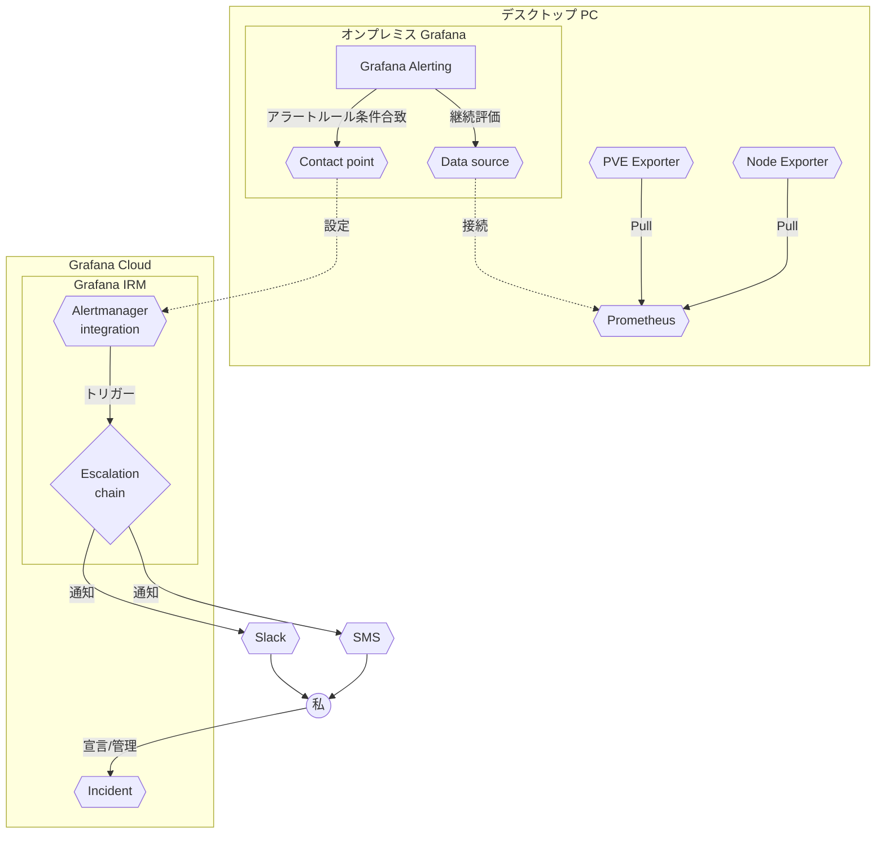
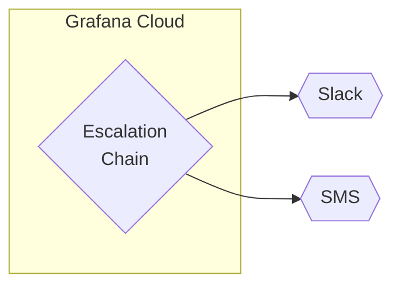
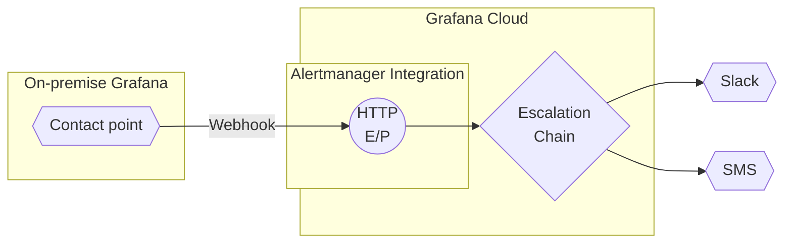

|||
| ---- | ---- |


Grafana (https://grafana.com/) は Observability ですが、ただダッシュボードを表示できるだけではなく、アラート機能やインシデント管理など、メトリクスを利活用した様々な機能が備わっています。その中の **Grafana IRM** を、家のデスクトップ PC（Proxmox Virtual Environment 導入機） を対象に試してみているので、それについての記事です!

## 本記事のスコープ

個人で使うとどんな感じかというのと、設定する際のノウハウについて述べています。設定方法の詳細や、ベストプラクティスにはこの記事ではあまり踏み込みません。また、紹介している設定内容は私の個人利用の内容を紹介しているので、運用に応じて調整してください!

参考になる公式ドキュメントのページへの URL を各所に貼っているので、必要に応じて参照してください！英語版のページを貼っていますが、ページ内から日本語版にアクセスできるページが多いです。正確な情報が欲しい・Grafana についてよく知らない、という方は特にリンク先記事も参考にしていただければと思います。

## 環境について

### 登場するツール

この記事ではこれらのツールが登場します!

- Grafana OSS（`grafana/grafana-enterprise` Docker イメージ）
  - Grafana Alerting ([doc](https://grafana.com/ja/products/cloud/alerting/)) ... メトリクス値を継続評価して、必要に応じてアラートを発火できる機能。
- Grafana Cloud ([doc](https://grafana.com/products/cloud/)) ... 自分でサーバを立てなくても Grafana が使える!
  - Grafana IRM ([doc](https://grafana.com/products/cloud/irm/)) ... Incident Response & Management 関連機能群。今回の主役!
    - Grafana OnCall ([doc](https://grafana.com/products/cloud/oncall/?pg=irm)) ... アラートを受信/ルーティングして、適切なユーザにエスカレートする。
    - Grafana Incident ([doc](https://grafana.com/products/cloud/incident/?pg=irm)) ... インシデント管理機能。

:::message
- OnCall と Incident は、2025/3 に 1 つの "Grafana IRM" に統合されたみたいです ([doc](https://grafana.com/blog/2025/03/11/oncall-management-incident-response-grafana-cloud-irm/))。公式ドキュメントだとまだ分かれている記述が多く見受けられますが、実際に Grafana を使う際は、OnCall と Incident の垣根は意識しなくても良さそうです。
- 公式ドキュメントに OnCall *OSS* についての記述がありますが、これは Grafana OSS とはもともと別コンテナで提供されていたものです。2025/7 現在メンテナンス状態で、2026/3 にアーカイブされるとのことです。この記事では Grafana Cloud IRM を使っているので関係ないです!
:::

### 無料枠について

2025/7 現在だと、Grafana Cloud 本体 も IRM も**ユーザー数単位での**課金（3 人まで無料）になっています。アラート数や、SMS/電話送信数での課金ではないようなので、他人を入れない限りはお金はかからなそうです！なんなら核家族も一人子どもならギリ耐えます。

ただし、メトリクスをつなぐ場合（Data source から Prometheus をつなぐ、など）は、ちゃんと最適化をしないと一瞬で無料枠を超えて大変なことになります。最初 2 週間はトライアルがあるので仮に使用量が跳ねても大丈夫ですが、もし Grafana Cloud をつなぐ際はご注意ください!

### 構成図

以下の図[^grafana-diagram-ref]のような構成で使っています。

[^grafana-diagram-ref]: 図は https://grafana.com/docs/oncall/latest/set-up/get-started/ を参考にしています。



**Grafana が 2 つある点に注目してください**！それぞれ、以下のような役割を担っています。

- デスクトップ PC 上で動いている、`grafana/grafana-enterprise` イメージ の Docker コンテナ（以下 "オンプレミス Grafana"）。
  **Prometheus からのデータ集約とアラート評価/発火**に使っています。
- Grafana Cloud 上のインスタンス（以下 "Grafana Cloud"）。
  オンプレミス Grafana からアラート発火を受信し、**各種サービスへの通知と対応状況管理**に使っています。

このように分けている理由は 2 つあります。

- **OSS の `grafana/grafana-enterprise` イメージでは提供されていない、Grafana Cloud 上用の機能がいくつか存在します**。Grafana IRM がそれに該当するので、その機能を使うために Grafana Cloud を使っています。
- Grafana Cloud とオンプレの Prometheus を繋いで、可視化まで Grafana Cloud ですることもできるのですが、**メトリクス量で使用量が計算される**ので、使用量削減のため、オンプレミス Grafana から Grafana Cloud にアラートを転送する形で連携しています。


### オンプレミス Grafana で設定しているアラート

オンプレミス Grafana では、**PVE 内の各コンテナのメモリ使用量が 80% を超えたら**アラートが発火するようにしています。

## 実際に動かしてみる

構築済みの環境を実際に動かしてみます!

:::message
- 環境構築手順は後述しています。そっちを読みたい方はこちらから→ [導入の仕方](#導入の仕方)
- 2 環境の Grafana のスクショが出てきますが、ライトテーマはオンプレミス Grafana、ダークテーマは Grafana Cloud 上の画面です！
:::

インシデント発生 → アラート評価/発火 → 各種媒体への通知 → Grafana Incident での宣言 → 対応/解決の流れを踏んでみます。**Python で 550,000,000 要素の配列 (`list(range(550_000_000))`) をアロケートして**、メモリをかなり圧迫してみます!

### インシデント発生からアラート認知まで

#### インシデント発生から Grafana Cloud 側でのアラート受信まで

Python で配列をアロケートすると、オンプレミス Grafana でアラートが発火します。ダッシュボード上でも、メモリが 3% 程度だったのが 90% 程度まで圧迫され、アラートが発火されたのが確認できます。


*黄色線と赤線は、それぞれアラートの Pending/Firing[^alert-state] への遷移があったタイミングです*
[^alert-state]: アラートルールで、「この条件が満たされてから n 秒後に正式に発火する」というのを決めることができます。このアラートルールではそれを 30 秒後にしていて、「条件が満たされてるけど様子見してる」状態が pending、「n 秒立ってもまだ条件が満ちているので、正式に発火した」状態が firing です。

オンプレミス Grafana 上の Alert Rules を見てみると、こちらでも発火されているのが確認できます。


少し待つと、**Grafana Cloud 上にアラートが表示されます**。


ここから、各種媒体への通知、インシデント対応管理がスタートします!

#### 各種媒体への通知

上の画像を見ると「"PVE CT/VM OOM"」という alert group[^group-with-only-one-alert?] ができていることがわかります。タイトルをクリックすると、アラートの概要やオンプレミス Grafana へのリンクが見れます。

[^group-with-only-one-alert?]: Grafana IRM では、似たようなアラートがいっぱい鳴って通知があっぷあっぷになるのを防ぐために、アラームはグループ化されて管理されます。とはいいつつ、今回は 1 アラートしか発火されていないので、1 アラートだけのアラートグループができています


画像右部を読むと分かる通り、この時点で、後述する "Escalation chain" がすでに走っていて、**私にアラートがエスカレートされています**。アラートがエスカレートされると、各種媒体に通知が飛んできます。


*Slack で通知が来ている*

:::details チームで使う場合 …… 手動で人を呼ぶこともできる
後述する Escalation chain で、最初に誰を呼ぶかを決められますが、実際の対応現場だと「これ〇〇さん呼ばないと」ということもあるかと思います。他の誰かを巻き込みたい場合、Alert groups の画面から手動で通知を飛ばすこともできます!


*Alert Group の詳細画面から、"Escalation Participants" → "Add participants" ボタンを押す*


*押すと、通知の重要度の設定と、通知送信の確認のモーダルが表示される*

私は "Important" の通知が来たときに SMS が飛ぶように設定しているので、"Important" で通知を発火すると SMS が飛んできます。


*SMS にも!*
:::

---

### アラートの認知からインシデント宣言/解決まで

今回は私が自分の手でインシデントを起こしたので最初からアラートの発火を知っていましたが、普段は気づかぬ間にアラートが燃えることがほとんどなので、**通常は Slack の通知で気づきます**。ここからはその体で、「Slack に通知が来てアラートの発火に今気づいた!」という状況を想定してアラートに対処してみます。

#### アラートの認知からインシデント宣言

Slack 等の通知でアラートに気づいたら、メッセージ内に、燃えている Alert groups の詳細へのリンクがあるので、見に行って状況を確認します。


*さっきの再掲です*

内容から、PVE の 100 番コンテナ[^pve-number] がメモリに困っていることがわかります。
Alert の存在を認知したら、"Acknowledge" ボタンを押してとりあえず Acknowledged 状態にします。
[^pve-number]: PVE では、コンテナ/仮想マシンに番号をつけて管理します。今回は番号 100 番のコンテナで Python のコードを実行していたので、100 番コンテナがメモリに困っています


*ステータスが変わった*

アラートに対する操作は終わったので、ここからインシデントを宣言します！Alert groups の "Actions" ボタンから、"Declare incident" をクリックします。


そうすると、"Declare Incident" というモーダルが出てきます。ここでインシデントの概要を設定します。


設定できたら、"Declare incident" を押してインシデントを宣言します!

#### インシデント宣言から対応開始

インシデントが宣言されると、Slack に通知が飛んできます。設定していれば、勝手にインシデント用のチャンネルが作られます。


*Slack 上での通知。ここからインシデントページ (後述) や、Slack チャンネルに行ける*


*新しく作られたチャンネル。勝手に呼ばれている!*

また、ブラウザ上ではインシデントページが確認できます。


このページで、インシデント対応にかかる情報や進捗状況、関係者などを管理することになります。今回は、Commander[^incident-role] を私、Investigator[^incident-role] も私に設定してみました（私しかいないので）。また、なんでこうなってるのかを調べるタスクも生やして私にアサインしてみました。
[^incident-role]: https://grafana.com/docs/grafana-cloud/alerting-and-irm/irm/configure/incident-settings/roles/#pre-configured-incident-roles


#### 対応から解決

タスクを振り分けたので、ここから実際に調査/解決に走ります。
なんでこうなってるのかを調べるべく、RAM を多く使っているプロセスを洗い出してみます。

```bash
$ ps aux --sort=-%mem | head -n 4
USER         PID %CPU %MEM    VSZ   RSS TTY      STAT START   TIME COMMAND
flisan      4300  3.2 85.7 21847108 21568256 pts/3 S+ 02:01   0:53 /usr/bin/python3
472          850  0.2  1.0 1821868 253204 ?      Ssl  Jul05   1:55 grafana server --homepath=/usr/share/grafana --config=/etc/grafana/grafana.ini --packaging=docker cfg:default.log.mode=console cfg:default.paths.data=/var/lib/grafana cfg:default.paths.logs=/var/log/grafana cfg:default.paths.plugins=/var/lib/grafana/plugins cfg:default.paths.provisioning=/etc/grafana/provisioning
nobody       837  0.0  0.4 1912724 114144 ?      Ssl  Jul05   0:41 /bin/prometheus --config.file=/etc/prometheus/prometheus.yml --storage.tsdb.path=/prometheus
```

ありました! `/usr/bin/python3` です。ユーザは私、メモリ使用率は 85.7%、TTY は `pts/3`。最初に大きな配列をアロケートしたあの Python で合っていそうです。
新しいことがわかったら Slack に書いてもいいですが、Grafana Cloud 上にも記しておけます。


*Slack 上にも転送されます*

情報を残しておいたところで、この Python プロセスを終了します。

```bash
$ kill 4300
```

メモリが解放されたことを確認するために、オンプレミス Grafana のダッシュボードを確認してみます。グラフが落ち込み、90% 程度から 3% 程度に戻っています！無事解決できました。


解決することができたので、"Active" をクリックして、Resolve ボタンを押します。すると、インシデントの要約の入力を求める Resolve Incident モーダルが表示されます。


ここで要約を入力して "Resolve" を押すと、インシデントは解決となります!


## 個人でも嬉しい理由

見ていただいた通り、Grafana IRM は、複数人でのインシデント対応において、情報伝達を自動化したり適切化するための機能が豊富に備わっています。そう思うと、一人で使うのが微妙かとも思えますが、プラットフォームを触るのが一人だけでも嬉しい理由がそれなりにあります!

- **通知で気付ける**
  アラート発火時に Slack や SMS その他いろいろな媒体で通知を送れるので、問題が起こった際に早期発見しやすいです。[^oncall-not-needed-technically]
  [^oncall-not-needed-technically]: Alerting だけでも Webhook を叩くことはできるので、通知がほしいだけなら実は Grafana IRM いらないです。でも SMS が送れるので、それが必要なら IRM を使う理由になりそう

- **あとから見返せる**
  特に個人だと、何か問題が起こった際の対応状況は、普通一回解決したら忘れることが多いかと思います。Grafana IRM を運用すると、時系列付きで対応状況を残せるので、苦難をあとから見返せますし、後から振り返って「なんで急にああなったんだろう……」と冷静に解析することもできます。記事に起こす際にも役立ちそうです!
  
- **使いやすい: 自然にログを残せる/管理しやすい**
  Grafana IRM は、`Slack で気づく → IRM でインシデント対応管理` の流れが自然に踏めるので、ログを非常に取りやすいです! 今回の記事ではあまり紹介していませんが、タグを付けて管理とかもできるので、後から見返しやすいです

- **Grafana との連携が楽**
  Grafana の機能なので当たり前ですが、**Grafana と繋がっていれば IRM を使うことができます!** 重要なのは、Grafana 自体はただのメトリクス活用ツールで、監視対象は電子機器に限られないということです。例えば、観葉植物の水やりを Grafana で管理しているなら、**センサーの値が途切れてアラートが来たと思ったら鉢が倒れてる！！** みたいなインシデントを管理できるかもしれません（嬉しいかはさておき…… 可能性の話です）

- **たのしい**
  1 人でこれやるのはごっこ遊びの側面も大きいです。一人でやるなら Commander/Investigator の設定とかいらないですし……

## 導入の仕方

:::message alert
**設定内容は私の個人利用の範囲での内容を紹介しています。**
運用に応じて調整してください!
:::

Grafana IRM の設定は、かなり柔軟にできる一方で、単純なルールでも設定が必要な項目がそれなりにあります。何を設定する必要があるかと、参考になるドキュメントへのリンクを掲載します!

:::details TL:DR;
1. Grafana Cloud の Profiles → IRM で、**通知先と Notification rules** を設定する。この画面で Slack を Connect すると楽
2. **Escalation chain** を作って、自分に通知が飛ぶように設定する
3. IRM で **Alertmanager Integration** を作って、**Escalation chain を紐づける**
4. オンプレ側でアラートルールの **Contact point を、Integration の HTTP Endpoint URL に向けた Webhook Contact Point**に設定する
:::

:::message
オンプレミス Grafana に関しては、**Data sources がつながっててパネル作成までできている**という前提で行きます。まだな方はぜひ設定してみてください。可視化は楽しいです!

[様々なプラットフォームで設定方法が紹介されているので、参考にしてみてください。](https://www.google.com/search?q=grafana+docker+prometheus+node+exporter)全部 Docker イメージが揃っているので、Docker Compose で構築するのが後々楽かと思います。
:::

### [Cloud 側] Grafana Cloud へのアカウント登録・Stack 作成

IRM を利用するために、Cloud へのアカウント登録が必要です。

https://grafana.com/products/cloud/?pg=hp&plcmt=hero-slide-1

アカウントを作ると、Grafana stack を作る画面が出てきます。少し待つと、Grafana Cloud の画面が出てきます！

:::message
オンプレから Cloud にデータをコピーするように勧められますが、無料枠の都合からあまりおすすめしないです。"Skip setup →" でスキップできます
:::

### [Cloud 側] 通知先を設定する

最初に自分個人の通知設定をします。

#### Notification channel
右上の自分のアイコン → Profiles → IRM から、通知先を設定することができます。

#### Notification rules
通知先の設定とは別に、Notification Rules タブで、まずどの媒体で通知して、連絡がつかなかったら次どうするか…… という設定をします。普通の通知と重要な通知毎に別々に設定できます。例えば……
- 普段は、まず Slack で通知して、5 分間レスポンスがなければ SMS
- 重要な通知は、Slack と SMS を同時に飛ばして、3 分レスがなければ電話

……みたいな設定ができます。[詳細/ベストプラクティスはこちら](https://grafana.com/docs/grafana-cloud/alerting-and-irm/irm/manage/notifications/notification-rules/)を参考にしてください。

#### Slack Integration
また、Slack の機能を使いたければその設定が必要です。個人の Slack ワークスペースを作っていなければ、ここで作ってしまいましょう!

[こちらの doc](https://grafana.com/docs/oncall/latest/configure/integrations/references/slack/)に詳しい説明がありますが、Notification channel の Slack 欄で "Install" を押すと、Slack App のインストールと Slack ユーザ名の連携が同時にできるのでめちゃくちゃ楽です。


### [Cloud 側] Escalation Chain を作る

通知が来たときに、通知の内容をもとにエスカレートの挙動（通知先のユーザ/チーム等）を決定することができます。ここでは、その挙動の部分を作成します。今回は個人利用なので、自分に notification を飛ばすようにします！

Alerts & IRM → IRM → Escalation chains から、"+ New escalation chain" で新しく Escalation chain を作成します。"Add escalation step..." から、"Notify users"、そして自分を指定すれば Escalation chain の設定が完了です!

[詳細はこちら](https://grafana.com/docs/oncall/latest/configure/escalation-chains-and-routes/#escalation-chains)を参考にしてください。

:::details Wait の使い方について
Escalation chain は、アラートが Resolve / Dismiss / Acknowledge されると止まるそうです。なので、こちらでも「N 分経ってもアラートが処理されなかったら〇〇をする」という設定ができそうです（e.g. 別の人に通知する、とか）。
:::

現時点だと、こんな感じの構成になっています。Escalation chain をトリガーするものがまだないので、まだ動きません。



### オンプレミス Grafana と Grafana Cloud をつなぐ

動画でわかりやすく説明されてる、公式ブログの記事があります!

https://grafana.com/blog/2025/06/03/how-to-send-alerts-from-grafana-oss-to-grafana-cloud-irm/

こちらの手順に従って、Integration を作って Escalation chain を紐づけます。

動画じゃない方が良ければ、[こちらのドキュメンテーション](https://grafana.com/docs/grafana-cloud/alerting-and-irm/irm/configure/integrations/integration-reference/oncall/grafana-alerting/#configure-external-grafana-alerting-from-other-grafana-instance)を参考にしてください。なお、このドキュメンテーションの手順に従って作る場合は、integration 作成後に最後の項目をクリックして Escalation Chain の紐づけが必要です!

:::message
Integration の画面で、"Add route" というボタンがありますが、これを使うと通知の内容に従って Escalation chain を変更することができます。ここでは詳しく触れませんが、個人利用でも Default / Important の振り分けなどができそうです!
:::

ここまで行くと、こういう構造になっています↓



### [オンプレミス側] アラートの Contact 先を Cloud に向ける

アラートがすでにある場合は、Grafana Cloud に向けたいアラートルールの編集画面に行きます。 アラートがまだなければ、[こちらの記事](https://grafana.com/docs/grafana/latest/alerting/alerting-rules/link-alert-rules-to-panels/)を参考にしてみてください!
どちらの場合でも、作成/編集の画面で Notification を設定する項目があるはずです。ここで、Contact point を先程作った Contact point に向けて、アラートを保存すると、そのアラートは Grafana Cloud に転送されるようになります!

---

これで設定完了です!

## おわりに

こういう、エンタープライズでも全然耐えそうなソリューションを個人でも試せるのは嬉しいです。無料枠の広さに大感謝です……!
Grafana のよいところの一つとして、どんなデータソースにも対応できるという点があります! Out-of-the-box で使えるデータソースも幅広いですが、RDBMS を使うこともできるので、自分独自のデータソースを開発して、今回紹介したことをする、とかもできます！可能性は無限です。

この記事は私の運用の紹介でしたが、自分はこういう運用してるとか、エンタープライズでの運用の知見を持っている方がいらっしゃったら、ぜひご教示いただければと思います！（私が知りたいだけですが…………）
